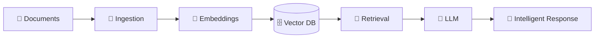

 

---

## 👨‍💻 `whoami`

<table align="center">
<tr>
<td width="55%">

### Hi, I'm Khalid 👋

I'm a **Software Engineer** focused on building intelligent, scalable and production-ready systems.

My current engineering focus is at the intersection of:

**🤖 Applied AI + 🧠 RAG + ⚡ Backend + ☁️ Cloud + 🔧 DevOps**

I enjoy taking an idea from:

`Architecture → Development → AI Integration → Deployment → Production`

and turning it into something people can actually use.

</td>

<td width="45%" align="center">

</td>
</tr>
</table>

---

## 🧠 `Applied AI / RAG`

  

 

---

## ⚡ What I Build

<table align="center">
<tr>
<td align="center" width="25%">

### 🤖

**AI Systems**

LLM Applications
RAG Pipelines
AI Assistants
Semantic Search

</td>

<td align="center" width="25%">

### ⚙️

**Backend**

Django
FastAPI
REST APIs
PostgreSQL

</td>

<td align="center" width="25%">

### ☁️

**Cloud**

Azure
Linux
Docker
Nginx

</td>

<td align="center" width="25%">

### 🚀

**SaaS**

Multi-Tenant
POS Systems
Automation
Business Tools

</td>
</tr>
</table>

---

## 🛠️ `Tech Stack`

### 🧠 AI / Machine Learning

  

### ⚙️ Backend

### 🎨 Frontend

### ☁️ Cloud & DevOps

---

## 🚀 `Currently Building`

  

Building scalable business software with:

`Django` · `React` · `PostgreSQL` · `Docker` · `Cloud Infrastructure`

---

## 📊 `GitHub Analytics`

  

---

## 🐍 `Contribution Graph`

---

## 🌐 `Connect With Me`

 

### `⚡ Build. Break. Learn. Ship. Repeat.`

